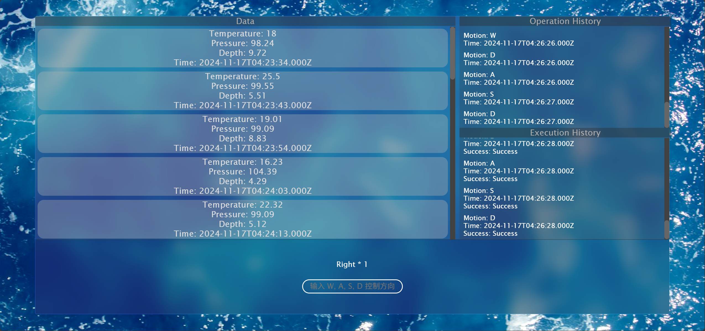

# 水下机器人上位机平台

OurEDA实验室web方向大二上作业——基于react、express的web网页应用程序，使用MQTT协议与下位机建立通信。下位机用python模拟，实现接收与发送信号。

<!-- PROJECT SHIELDS -->

[![Contributors][contributors-shield]][contributors-url]
[![Forks][forks-shield]][forks-url]
[![Stargazers][stars-shield]][stars-url]
[![Issues][issues-shield]][issues-url]
[![MIT License][license-shield]][license-url]
[![LinkedIn][linkedin-shield]][linkedin-url]

<!-- PROJECT LOGO -->
<br />

<p align="center">
  <a href="https://github.com/ProselyteCoding/IoT-host-computer-platform-for-underwater-robots/">
    
  </a>

  <h3 align="center">水下机器人上位机平台</h3>
  <p align="center">
    OurEDA实验室web方向大二上作业——基于react、express的web网页应用程序，使用MQTT协议与下位机建立通信。下位机用python模拟，实现接收与发送信号。
    <br />
    <a href="https://github.com/ProselyteCoding/IoT-host-computer-platform-for-underwater-robots"><strong>探索本项目的文档 »</strong></a>
    <br />
    <br />
    <a href="https://github.com/ProselyteCoding/IoT-host-computer-platform-for-underwater-robots">查看Demo</a>
    ·
    <a href="https://github.com/ProselyteCoding/IoT-host-computer-platform-for-underwater-robots/issues">报告Bug</a>
    ·
    <a href="https://github.com/ProselyteCoding/IoT-host-computer-platform-for-underwater-robots/issues">提出新特性</a>
  </p>

</p>

 
## 目录

- [上手指南](#上手指南)
  - [项目效果](#项目效果)
  - [安装步骤](#安装步骤)
- [文件目录说明](#文件目录说明)
- [不足](#不足)
- [部署](#部署)
- [版本控制](#版本控制)
- [作者](#作者)
- [版权说明](#版权说明)

### 上手指南

###### 项目效果

  <p>
      
  </p>

###### **安装步骤**

1. Get a free API Key at [https://github.com/ProselyteCoding/IoT-host-computer-platform-for-underwater-robots.com](https://https://github.com/ProselyteCoding/IoT-host-computer-platform-for-underwater-robots.com)
2. Clone the repo

```sh
git clone https://github.com/ProselyteCoding/IoT-host-computer-platform-for-underwater-robots.git
```
3. Install necessary files

  Open the terminal and input the following instructions in lines.

  ```
  cd backend
  npx nodemon index.js
  cd ..
  cd mqtt
  python mqtt.py
  cd..
  cd frontend
  npm start
  ```
  You will successfully run the whole project if evrerything works fine! 
   

### 文件目录说明

```
IoT-host-computer-platform-for-underwater-robots/
├── backend/
│   ├── controllers/
│   │   ├── data.js
│   │   └── motion.js
│   ├── routes/
│   │   ├── data.js
│   │   └── motion.js
│   ├── mqtt/
│   │   └── mqtt.py
│   ├── .env
│   ├── .gitignore
│   ├── db.js
│   ├── index.js
│   ├── mqtt.js
│   ├── package-lock.json
│   └── package.json
├── frontend/
│   ├── src/
│   │   ├── components/
│   │   │   ├── control/
│   │   │   │   ├── control.css
│   │   │   │   └── control.jsx
│   │   │   └── show/
│   │   │       ├── show.css
│   │   │       └── show.jsx
│   │   ├── App.css
│   │   ├── App.jsx
│   │   ├── index.css
│   │   └── index.jsx
│   ├── public/
│   │   ├── index.html
│   │   ├── favicon.ico
│   │   └── bg.jpg
│   ├── .gitignore
│   ├── package-lock.json
│   └── package.json
├── mqtt/
│   ├── mqtt.py
├── LICENSE.txt
├── logo.png
└── README.md

```

### 不足 

使用git进行版本控制时未注意提交的命名格式，不够规范。

### 部署

暂无

### 版本控制

该项目使用Git进行版本管理。

### 作者

陈胤 王一帆

### 版权说明

该项目签署了MIT 授权许可，详情请参阅 [LICENSE.txt](https://github.com/ProselyteCoding/IoT-host-computer-platform-for-underwater-robots/blob/master/LICENSE.txt)


<!-- links -->
[your-project-path]:ProselyteCoding/IoT-host-computer-platform-for-underwater-robots
[contributors-shield]: https://img.shields.io/github/contributors/ProselyteCoding/IoT-host-computer-platform-for-underwater-robots.svg?style=flat-square
[contributors-url]: https://github.com/ProselyteCoding/IoT-host-computer-platform-for-underwater-robots/graphs/contributors
[forks-shield]: https://img.shields.io/github/forks/ProselyteCoding/IoT-host-computer-platform-for-underwater-robots.svg?style=flat-square
[forks-url]: https://github.com/ProselyteCoding/IoT-host-computer-platform-for-underwater-robots/network/members
[stars-shield]: https://img.shields.io/github/stars/ProselyteCoding/IoT-host-computer-platform-for-underwater-robots.svg?style=flat-square
[stars-url]: https://github.com/ProselyteCoding/IoT-host-computer-platform-for-underwater-robots/stargazers
[issues-shield]: https://img.shields.io/github/issues/ProselyteCoding/IoT-host-computer-platform-for-underwater-robots.svg?style=flat-square
[issues-url]: https://img.shields.io/github/issues/ProselyteCoding/IoT-host-computer-platform-for-underwater-robots.svg
[license-shield]: https://img.shields.io/github/license/shaojintian/Best_README_template.svg?style=flat-square
[license-url]: https://github.com/shaojintian/Best_README_template/blob/master/LICENSE.txt
[linkedin-shield]: https://img.shields.io/badge/-LinkedIn-black.svg?style=flat-square&logo=linkedin&colorB=555
[linkedin-url]: https://linkedin.com/in/shaojintian
